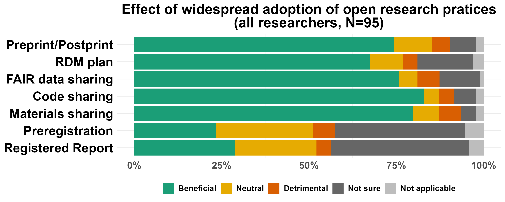
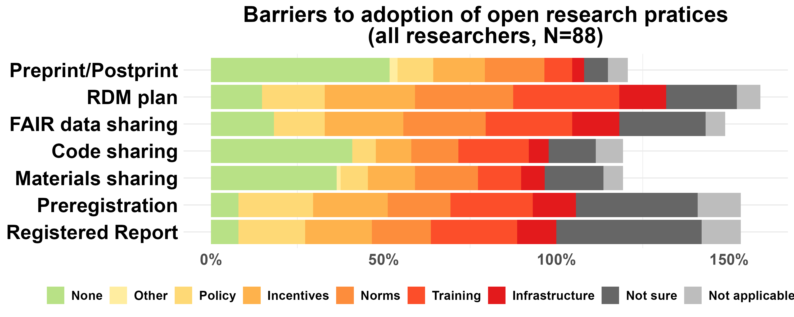

```{=html}
<style>
body {
text-align: justify}
</style>
```
```{=html}
<style type="text/css">
h1.title {
  text-align: center;
}

</style>
```

```{r setup, include=FALSE}
library(flextable)
library(tidyverse)
library(here)
library(knitr)
library(officer)
library(bookdown)

set_flextable_defaults(
  digits = 1,
  font.color = "black",
  font.family = "Calibri", 
  font.size = 10,
  line_spacing = 1 
  )

options(dplyr.summarise.inform = FALSE) # Suppress summarise info 'summarise() has grouped output by '
```

```{r, echo = FALSE, include = FALSE}
source(here::here("Rscripts","FormatData.R"))

source(here::here("Rscripts","Awareness.R"))

aware <- round(mean(data_Awareness_for_plotting$perc[data_Awareness_for_plotting$Answer == "using"] +
                    data_Awareness_for_plotting$perc[data_Awareness_for_plotting$Answer == "aware"] +
                    data_Awareness_for_plotting$perc[data_Awareness_for_plotting$Answer == "practicing"],0))

aware_butpreregRR <- round(mean(data_Awareness_for_plotting$perc[data_Awareness_for_plotting$Answer == "using" &
                                                                  !(data_Awareness_for_plotting$LabelIndiv %in% c("Preregistration", "Registered Report"))] + 
                    data_Awareness_for_plotting$perc[data_Awareness_for_plotting$Answer == "aware" &
                                                                  !(data_Awareness_for_plotting$LabelIndiv %in% c("Preregistration", "Registered Report"))] +
                    data_Awareness_for_plotting$perc[data_Awareness_for_plotting$Answer == "practicing"&
                                                                  !(data_Awareness_for_plotting$LabelIndiv %in% c("Preregistration", "Registered Report"))],0))
  
aware_dont_practice <- round(mean(data_Awareness_for_plotting$perc[data_Awareness_for_plotting$Answer == "using"]+ 
                                    data_Awareness_for_plotting$perc[data_Awareness_for_plotting$Answer == "aware"],0))
practice <- round(mean(data_Awareness_for_plotting$perc[data_Awareness_for_plotting$Answer == "practicing"],0))

practice_butpreregRR <- round(mean(data_Awareness_for_plotting$perc[data_Awareness_for_plotting$Answer == "practicing"&
                                                                  !(data_Awareness_for_plotting$LabelIndiv %in% c("Preregistration", "Registered Report"))],0))

source(here::here("Rscripts","Effect.R"))

beneficial_all <- round(summary(data_Effect_for_plotting$perc[data_Effect_for_plotting$Answer == "beneficial"]),0)
detrimental_all <- round(summary(data_Effect_for_plotting$perc[data_Effect_for_plotting$Answer == "detrimental"]),0)

beneficial_sharing <- round(summary(data_Effect_for_plotting$perc[data_Effect_for_plotting$Answer == "beneficial" & 
                                                                    (data_Effect_for_plotting$LabelIndiv == 'Code sharing' |
                                                                      data_Effect_for_plotting$LabelIndiv == 'FAIR data sharing' |
                                                                       data_Effect_for_plotting$LabelIndiv == 'Preprint/Postprint'|
                                                                       data_Effect_for_plotting$LabelIndiv == 'Materials sharing')]),0)

beneficial_planning <- round(summary(data_Effect_for_plotting$perc[data_Effect_for_plotting$Answer == "beneficial" & 
                                                                    (data_Effect_for_plotting$LabelIndiv == 'RDM plan' |
                                                                      data_Effect_for_plotting$LabelIndiv == 'Preregistration' |
                                                                     data_Effect_for_plotting$LabelIndiv == 'Registered Report')]),0)

detrimental_material_code <-  round(summary(data_Effect_for_plotting$perc[data_Effect_for_plotting$Answer == "detrimental" & 
                                                                    (data_Effect_for_plotting$LabelIndiv == 'Code sharing' |
                                                                       data_Effect_for_plotting$LabelIndiv == 'Materials sharing')]),0) 

beneficial_preregRR<- round(summary(data_Effect_for_plotting$perc[data_Effect_for_plotting$Answer == "beneficial" & (
                                                                      data_Effect_for_plotting$LabelIndiv == 'Preregistration' |
                                                                       data_Effect_for_plotting$LabelIndiv == 'Registered Report')]),0)

unsure_preregRR<- round(summary(data_Effect_for_plotting$perc[data_Effect_for_plotting$Answer == "unsure" & (
                                                                      data_Effect_for_plotting$LabelIndiv == 'Preregistration' |
                                                                       data_Effect_for_plotting$LabelIndiv == 'Registered Report')]),0)

beneficial_all_butpreregRR <- round(summary(data_Effect_for_plotting$perc[data_Effect_for_plotting$Answer == "beneficial" & (
                                                                      data_Effect_for_plotting$LabelIndiv != 'Preregistration' &
                                                                       data_Effect_for_plotting$LabelIndiv != 'Registered Report')]),0)

source(here::here("Rscripts","Barriers.R"))

data_Barriers_for_plotting$Answer <- factor(data_Barriers_for_plotting$Answer, levels= rev(Barriers_answers))

av_barrier_perc <- data_Barriers_for_plotting %>%
  group_by(Answer) %>%
  summarise(
    avg_perc = round(mean(perc, na.rm = TRUE),0),
    .groups = "drop"
  )

av_barrier_perc$Answer <- barriers_answer_map[av_barrier_perc$Answer]

transposed <- t(av_barrier_perc$avg_perc)
colnames(transposed) <- as.character(av_barrier_perc$Answer)

transposed <- as.data.frame(transposed)

source(here::here("Rscripts","Training.R"))

training_needs <-  data_Training_for_plotting[
    data_Training_for_plotting$Answer %in% c('workshop', 'written'),] %>% group_by (LabelIndiv) %>%  
    summarise (TotalPerc = sum(perc))

training_needs_av <- round(summary(training_needs$TotalPerc),0)

written_needs_preprint_licence_material <- round(mean(data_Training_for_plotting$perc[
    data_Training_for_plotting$Answer == 'written' & data_Training_for_plotting$LabelIndiv %in% c('Preprint/Postprint', 'Licences', 'Materials sharing')]),0) 

workshop_needs_rdm_fair_code <- round(mean(data_Training_for_plotting$perc[
    data_Training_for_plotting$Answer == 'workshop' & data_Training_for_plotting$LabelIndiv %in% c('RDM plan', 'FAIR Data sharing', 'Code sharing')]),0) 

source(here::here("Rscripts","Support.R"))

support_need <- data_Support_for_plotting[
    data_Support_for_plotting$Answer %in% c('essential', 'useful'),] %>% group_by (LabelIndiv) %>%  
    summarise (TotalPerc = sum(perc))

support_need_av <- round(summary(support_need$TotalPerc),0)

most_essential <- data_Support_for_plotting$LabelIndiv[!is.na(data_Support_for_plotting$perc ) & data_Support_for_plotting$perc == max(data_Support_for_plotting$perc[
    data_Support_for_plotting$Answer== 'essential'])] 

source(here::here("Rscripts","CriteriaDifference.R"))

source(here::here("Rscripts","OtherCurrentCriteria.R"))

source(here::here("Rscripts","OtherDesiredCriteria.R"))

source(here::here("Rscripts","Downsides.R"))

no_downsides <- round(summary(data_Downsides_for_plotting$perc[data_Downsides_for_plotting$Answer == 'no']),0)
yes_downsides <- round(summary(data_Downsides_for_plotting$perc[data_Downsides_for_plotting$Answer == 'yes']),0)

downsides_material_code <- round(summary(data_Downsides_for_plotting$perc[data_Downsides_for_plotting$Answer == 'yes' & 
                                         (data_Downsides_for_plotting$LabelIndiv == 'Code sharing' |
                                          data_Downsides_for_plotting$LabelIndiv == 'Materials sharing')]),0)

source(here::here("Rscripts","OtherBarriersWhatDownsides.R"))


```

# EXECUTIVE SUMMARY

The LMU Open Science Center ([OSC](https://www.osc.uni-muenchen.de/index.html)) circulated a survey to researchers of the Biomedical Center ([BMC](https://www.med.lmu.de/bmc/en/)) of LMU Munich between December 2024 and January 2025. We asked the views of researchers on open research practices and recruitment criteria, as well as related training needs and provision.

## Results
-   A majority of respondents (`r aware`%) are **aware** of the given open research practices (i.e. either practicing, or only using resources shared by others, or aware only), but only `r practice`% of respondents practices them.
-   The majority of respondents (`r beneficial_all_butpreregRR[4]`%) thinks that open research practices (among practices they are familiar with) would largely be **beneficial** for their field of research if widely adopted .
-   Lack of training, norms, and incentives are generally perceived to be the biggest **barriers** to adoption of open research practices (each endorsed by ~20% of respondents across open research practices). Only a quarter of respondents indicated there are no barriers to adoption.
-   The demand for **training** is extremely high (`r training_needs_av[4]`% on average across all topics presented) with highest demand for workshop-led training for topics such as RDM plan, FAIR data sharing, and code sharing.
-   All means of **support and community building activities** suggested (e.g. consultation with experts, support network of peers) are largely thought useful or essential (on average by `r support_need_av[4]`% of respondents).
-   Comparing current and desired **recruitment criteria**: respondents think prestige of publication outlet and number of publications are currently weighting too heavily, while quality of publication, supervision and mentoring, and open research practices ought to weigh more.

## Recommendations
We recommend the BMC to collaborate with the OSC and access the following OSC services to address their need:

-   Regular peer-to-peer workshops and yearly summer school on open research practices (see [OSC events](https://www.osc.uni-muenchen.de/events/index.html))
-   Open research Train-the-Trainer program (see [press release](https://www.lmu.de/en/newsroom/news-overview/news/bringing-transparency-to-research-practice.html))
-   Close consultation of a research group with an expert to design an optimal open research workflow tailored to their study type (Switch to Open program, see [press release](https://www.lmu.de/en/newsroom/news-overview/news/bringing-transparency-to-research-practice.html))
-   Consultations for community engagement
-   Consultations with graduate programs to integrate open research training in their curriculum
-   Consultations with hiring committees to redesign their research assessment criteria
-   Consultations with governing board to create public statements or internal recommendations for their research groups

Note that access to these services is given in priority to funding OSC institutional members ([more information](https://www.osc.uni-muenchen.de/members/institutional-members/funding_inst_memb/index.html)). 

We also recommend to advertise and amplify openly licensed resources from the OSC (websites in construction, expected by October 2025):

-   [OSC self-learning resources](https://github.com/lmu-osc)
-   OSC self-learning Train-the-Trainer resources
-   Lab handbook created by switched research groups that can be adapted by further groups

## Methods
-   We asked respondents about **7 open research practices**: green open access publishing through preprints and postprints, Research Data Management (RDM) plans, FAIR data sharing, code sharing, materials sharing, preregistration, and registered reports. We also asked about perceptions of **current and ideal recruitment criteria** in the context of hiring.
-   In total, **`r table_SS$"Overall n"[table_SS$"Question topic" == "Role"]` researchers participated** in the survey, of which<!-- !!! need manual updating !!--> 26 were group leaders, 37 postdocs, 17 research support staff, 46 PhD students, and 4 MSc students. `r table_SS$"Overall n"[table_SS$"Question topic" == "Support"]` answered all questions. All responses available for a given question were analysed.
-   Respondents self-selected to take part, so results may be biased; for instance, in favor of researchers already aware of or experienced with open research practices.

\newpage
# BACKGROUND AND METHODS

## Aims

The LMU Open Science Center (OSC) is a grassroots initiative advancing open research across all disciplines at LMU Munich.
The OSC is disseminating a survey (derived from @OxfordSurvey) to inform the implementation of open research practices and responsible research assessment at LMU Munich.

This data was collected at the Biomedical Center (BMC) with the additional goal to identify candidate groups to enter the Switch to Open Programme (SwoP).
The SwOP is an educational intervention tailored to research groups with the goal to implement open research practices sustainably in their daily workflows.
All team members of groups entering the SwOP receive open research training on topics relevant to them, and design, implement, and document an optimal open workflow for their research.

## Definitions of open research practices

Broadly, open research (or, in some disciplines, 'open science') refers to efforts to ensure that different elements of the research process are transparent and accessible.
Definitions of relevant terms vary across fields of research and contexts, and the survey provided the following definitions:

**Preprint** An article, book chapter, book, or other scholarly work that is deposited in a repository with unrestricted access (i.e. available to the public to view online, or download, without registration, payment, or approval) ahead of peer review. Equivalent terms used in some disciplines are 'working paper' and 'unpublished manuscript'.

**Postprint** Accepted version of an article, book chapter, book, or other scholarly work that is released by the author(s) on a repository with unrestricted access (i.e. available to the public to view online, or download, without registration, payment, or approval)

**Open Access publication** An article, book chapter, book, or other scholarly work that is released with unrestricted access (i.e. available to the public to view online, or download, without registration, payment, or approval). This includes all forms of open access, such as 'green' (i.e. preprints or postprints), and 'gold' (i.e. the version processed by the publisher is released openly on the publisher’s system upon publication, after payment of article or book processing charges by the author(s)).

**Repository** A service dedicated to facilitating the preservation and sharing of research content, including digital repositories (for digital collections, data, code, etc.) and physical repositories (for collections, archives, reagents, specimens, etc.). The service may be operated by universities, governments, or private organisations, and it can be domain-agnostic or discipline-specific. Access to such repositories may be open or controlled (e.g. requiring registration, payment, or approval). Personal web-pages or other ad hoc methods of storing and sharing research content are not included.

**Data** Any information underpinning a piece of research. The information can be qualitative (e.g. source, archive, representation of art, artefact) and/or quantitative (e.g. measurements, machine output, simulation results). The data can be raw (i.e. as collected), cleaned (i.e. corrected for errors), or prepared/processed (e.g. transformed into a different format for analysis, or anonymized for sharing).

**Metadata** Data that provides information about other data, allowing data users to contextualise the data (e.g. author, title, date, keywords, study design), know precisely how and what data was collected (e.g. variable X measured in Y unit on a continuous scale with machine Z, compiled for each variable in a codebook/data dictionary), and how to (re)use the data (e.g. data reuse agreement, licence). In practice, a data dictionary that provides sufficient information for the data to be reused is often created at the beginning of a project and continuously updated.

**Research Data Management plan** A written document describing the data to be collected or used during a research project, and how they will be managed, analysed, stored, shared, and preserved.

**FAIR principles** Set of principles to ensure data and other (digital) material is findable, accessible, interoperable and reusable by machines and humans. In short, data sharing is FAIR when the data is:
_Findable_: metadata should be deposited in a searchable repository and be assigned a permanent identifier;
_Accessible_: the data is either open, or accessible upon some authentication process, or closed, but with open metadata;
_Interoperable_: the data is described with a standard terminology (so the dataset can be merged with other ones) and saved in a stable file format;
_Reusable_: the data is richly documented and is accompanied by a data usage licence.

**Code** Custom software developed by researchers specifically for the purpose of conducting a piece of research (e.g. a computer program to extract, clean, or analyse data, or to generate simulation results), or to build components of a research data infrastructure (e.g. a data repository).

**Reproducible research** Research from which the same outcomes or results can be rederived from the data with the documentation and/or code provided. In practice, this can, for example, be achieved by creating a computationally executable pipeline including e.g. data acquisition, data processing, and data analysis, and be eased by software engineer tools such as programming (e.g. R, Python), version control (e.g. Git), software package managers (e.g. Renv, Anaconda), literate programming (e.g. Rmarkdown, Quarto), and computational environment containers (e.g. Binder, Docker).

**Materials** Any element of the research process that can be coded digitally or shared physically (e.g. protocols, survey questions, instructions, intervention materials, videos of the study procedure, specimens, reagents, samples, and other items used to collect data and/or conduct the research).

**Preregistration** The practice by which researchers specify elements of the planned work in a dedicated registry before observing the outcomes of the work. Examples include description of the planned approach for a qualitative study, and the data analysis plan for a quantitative study (i.e. a ’pre-analysis plan’, which can be submitted either before the start of data collection or, for previously collected datasets, before the start of data analysis).

**Registered report** A journal article format in which research question(s) and methodology are peer-reviewed before the work is conducted. A submission may be provisionally accepted for publication following peer-review, and eventually published if the authors follow through with the methodology specified in the accepted version (deviations from the registered plan are allowed, but they must be explicitly justified and noted as such). Acceptance of the article to the journal is therefore independent of the results obtained.

The purpose of the last two practices is to provide a transparent documentation of the research planning process. In the case of quantitative research, one major element of this transparent documentation that preregistration and/or registered reports provide is to be able to distinguish between _a priori_ confirmatory analyses, which test hypotheses according to certain statistical parameters, vs exploratory analyses that have a higher rate of false-positive results but have the advantages of generating hypotheses.

## Survey administration

Between December 4, 2024 and January 15, 2025, the survey was distributed via email and promoted at departmental seminars to BMC members of the following career stages:

-   Professor, Junior Professor, Research Group Leader, University Lecturer (e.g. W1, W2, W3, Prof., PD., apl. Prof.);
-   Research Staff or Fellow (e.g. Dr. or PhD title-holder who do not lead their own group, Postdoc, ARaL, ARaZ);
-   Doctoral Student;
-   Research Support Staff (Research Coordinator/Manager/Officer/Facilitator, Data Analyst/Steward/Manager, Research Software Engineer, Bioinformatician, Statistician);
-   Masters Student in a research program.

## Sample sizes
In total, **`r table_SS$"Overall n"[table_SS$"Question topic" == "Role"]`** researchers participated in the survey.
We kept respondents' answers whether they completed the survey or not.
This means that the sample size can decline question after questions. Table \@ref(tab:tabSS) shows the number of respondents per question, in the order they were asked.

```{r, echo = FALSE, include = TRUE}
table_SS %>% flextable() %>% 
    set_caption(caption = "Number of respondents",
                style = "Table Caption", 
                autonum = run_autonum(seq_id = "tab", bkm = "tabSS")) %>% autofit()
```

## Data and materials

Data, code, and materials for the study are available openly at the following link: https://zenodo/FIXME <!--# share excel sheet with formR survey with data and code on Github published on zenodo -->

\newpage
# RESULTS
## Awareness of open research practices
The first open research question of the survey was:
"**Which of the following research practices are you aware of, and which do you have experience with?** ‘Aware only’ indicates that the practice is applicable to your discipline, but you do not have direct experience with it. ‘Accessing/using only’ refers to resources that are made available by others and are reused by yourself. ‘Practicing myself’ relates to implementation of the practice in your own research (in addition to, or instead of, accessing/using resources made available by others)."

The average level of awareness, combining respondents who are aware only (Fig. \@ref(fig:awareness), in orange), using open resources (yellow), or practicing open research practices (green), is `r aware`%. This level reaches `r aware_butpreregRR`% when removing preregistration and registered reports, the two least known practices (Fig. \@ref(fig:awareness), in red). However, while levels of awareness are high, the level of adoption (in green) is on average only `r practice`% across practices (`r practice_butpreregRR`% when removing preregistration and registered reports).   


***Overall, despite a rather high level of awareness for most practices, there is a rather low level of adoption.*** 

## Overall effect of open research practices
The next question was:
"**In your opinion, what would be the overall effect of widespread adoption of the following practices in your field of research?**"

Figure \@ref(fig:effect) shows that the majority of respondents finds that the overall effect of a widespread adoption of resource sharing (preprint/postprint, FAIR data sharing, code sharing, material sharing) would be beneficial (on average `r beneficial_sharing[4]`%, ranging from `r beneficial_sharing[1]`% to `r beneficial_sharing[6]`%).
In contrast, research planning with preregistrations and registered reports were not considered highly beneficial practices, not because respondents considered these practices detrimental, but because they did not know much about these practices (on average only `r beneficial_preregRR[4]`% of respondents found these practices beneficial, and `r unsure_preregRR[4]`% were not sure about their effects). 



***Overall, most respondents found that the practices they were aware of would have beneficial effects in their field if widely adopted.***

## Barriers to adoption of open research practices
Our data from the first two survey questions show that despite respondents' overall awareness and support for these practices, there is an implementation gap.
We then asked respondents about the barriers that might prevent them from taking up open research practices. We divided these barriers into 5 main categories of factors relevant to their adoption:

-   **infrastructure**, i.e. tools, resources, and/or services that enable implementation of the practice (e.g. repositories for digital or physical storage; registries for preregistration; publishing platforms or outlets) and of relevant community standards (e.g. guidelines relating to citation of data and metadata; ethical and legal guidelines for sharing sensitive data);
-   **training**, i.e. the acquisition of knowledge and/or skills needed to implement the practice;
-   **norms**, i.e. widespread attitudes and behaviours that support and/or encourage the practice (e.g. the perception that the field is aware of the practice and in favour of implementation; interest from early-career researchers; support from supervisors, mentors);
-   **incentives**, i.e. resources and/or mechanisms that reward the practice (e.g. dedicated funding; institutional award; research assessment criteria for hiring and promotion);
-   **policy**, i.e. a requirement to implement the practice by relevant stakeholders (e.g. institutions, funders, publishers).

These factors are making the adoption of open research practices respectively possible, easy, 'normal', rewarding, and/or required, according to the strategy for culture change proposed by Prof. Brian Nosek of the Center for Open Science (Fig. \@ref(fig:pyramid), https://www.cos.io/blog/strategy-for-culture-change).

```{r pyramid, fig.cap="Factors which may influence the adoption of open research practices", out.width="55%", echo = FALSE}

```

We did not include ‘time pressure’ as one of our answer choices, even though it is often cited as a barrier to uptake of new practices.
Rather, we consider availability of time, or lack thereof, as a consequence of the factors listed above. For example, a researcher may choose to invest the time required to adopt a practice depending on:

-   the availability of infrastructure or training, which facilitate implementation;
-   the existence of norms in the community, which mitigate the burden on the researcher;
-   the presence of incentives, or policy, which reward and/or mandate the practice in the researcher's field or institution.

Specifically, we asked: "**Do you face any barriers in adopting the following practices and, if so, what are they?** Tick all that apply. If you tick “Other” you can  provide a brief description of additional barriers."

Because respondents could select multiple options, percentages would reach 100% if each respondent would select only one response, and go beyond 100% when they select multiple responses (Fig. \@ref(fig:barrier)). 



On average, only `r transposed[,"None"]`% of respondents found that there was no barrier to the adoption of open research practices (Fig. \@ref(fig:barrier), in green, Table \@ref(tab:tabbarrier)).


```{r, echo = FALSE, include = TRUE}
transposed %>% flextable() %>%
    set_caption(caption = "Percentages of respondents who selected each answer (non-mutually exclusive), averaged across all practices, summarizing Figure 4", # !!! need manual updating for figure number!!!
                style = "Table Caption",
                autonum = run_autonum(seq_id = "tab", bkm = "tabbarrier")) %>% autofit()
```

All suggested barriers were found by other respondents for all practices (Fig. \@ref(fig:barrier)). On average, and in order of importance, the barriers to adoption of open research practices found were: Training, Norms, Incentives, Policy, and Infrastructure (Table \@ref(tab:tabbarrier)).

***Overall, respondents seem to perceive many barriers to adoptions.***

In the following sections, we review each barrier categories, adding data from further survey questions, in the order presented in the pyramid (Fig. \@ref(fig:pyramid)), starting from it's base, i.e. infrastructure. 
That is, the survey questions are not presented in the order they were asked (for this, see Table \@ref(tab:tabSS)). 

For each barrier, we also present additional resources and knowledge, as well as services of the LMU Open Science Center, to provide first guidance on how to alleviate them. 

### Infrastructure

A relatively small lack of infrastructure was found for each practice (Fig. \@ref(fig:barrier), Table \@ref(tab:tabbarrier)).
We here provide some information that possibly addresses the perception of a lack of infrastructure:   

-   **preprint/postprint**: discipline agnostic preprint servers exist (e.g. [OSF Preprints](https://osf.io/preprints), [Open Access LMU](https://epub.ub.uni-muenchen.de/)) and specific tools can help quickly identify the regulations of a prospective publisher (e.g. https://openpolicyfinder.jisc.ac.uk/)
-   **RDM plan**: the LMU Library provides the tool Research Data Management Organiser ([RDMO](https://rdmo.ub.uni-muenchen.de/)) with many templates to comply with specific funders’ requirements.
-   **FAIR data sharing**: in cases where discipline-specific repositories do not exist, there are discipline-agnostic repositories (e.g. [Zenodo](https://zenodo.org/), [Open Data LMU](https://data.ub.uni-muenchen.de/)) that still allow to share data following the FAIR principles. But indeed, some disciplines do not have metadata standards (yet) that would maximise the reuse of the data. Additionally, some raw data are indeed too big to be stored on public repositories and, in these cases, only processed data can be shared publicly, or raw data can be hosted on  the research group' servers and a request form can be associated with the metadata posted on a public repository.
-   **code sharing**: discipline agnostic repositories (e.g. [Zenodo](https://zenodo.org/)) can be used to share code.
-   **materials sharing**: discipline agnostic repositories (e.g. [Zenodo](https://zenodo.org/), [OSF](https://osf.io/)) can be used to share digital material. However, only few repositories currently exist to share physical materials (e.g. [DSMZ – German Collection of Microorganisms and Cell Cultures](https://www.dsmz.de/), for Cell lines, bacteria, fungi, viruses, DNA; [EuroBioBank](http://www.eurobiobank.org/) for DNA, RNA, tissues, cell cultures of rare diseases, [Addgene](https://www.addgene.org/) for plasmids and antibodies).
-   **preregistration**: discipline agnostic preregistration platform exists (e.g. [OSF preregistration](https://osf.io/registries)).
-   **registered report**: the list of journals providing or requesting this format is maintained at https://cos.io/rr in the tab 'participatory journals'.  

***Overall, in light of the infrastructure available to researchers, we argue that the perceived concern of lack of infrastructure by respondents has largely been alleviated through infrastructure providers and Open Science communities.***

### Training
Addressing the main barrier to adoption of open research practices (Table \@ref(tab:tabbarrier)), i.e. lack of training, in more details, we asked:
"**For which of the following topics do you think more guidance is necessary?** ‘No guidance needed’ indicates that sufficient guidance on the topic is available to you. ‘No guidance wanted’ indicates that you do not see the net benefit of engaging with the topic. Please list any additional topics in the empty boxes below."

The topics listed were:

-   How to share preprints or postprints (e.g. selection of appropriate repository, consideration of publisher’s rights, ethical considerations) [labelled **Preprint/Postprint** in Fig. \@ref(fig:training)]
-   How to prepare Research Data Management plans [labelled **RDM plan**]
-   How to prepare data and metadata for archiving, and possibly for sharing in a public repository in line with community standards and the FAIR principles [labelled as **FAIR data sharing**.]
-   How to prepare ethics applications and consent forms that allow archiving of anonymised data in a public repository [labelled **Ethics**]
-   How to prepare sensitive dataset in ways that protect privacy and security (e.g. anonymised or synthetic dataset, controlled or tiered access) [labelled **Data anonymisation**]
-   How to create a reproducible research workflow (including e.g. writing code, using version control and  literate programming) and share it publicly (e.g. selection of a repository that assigns a DOI) [labelled **Code sharing**]
-   How to prepare materials for sharing (e.g. in a digital repository that assigns a DOI, or in a physical repository) [labelled **Material sharing**]
-   How to choose and apply licences or reuse agreements for sharing resources (e.g. data, materials, and/or code) and navigate relevant legislation (including copyright law, privacy and GDPR law, commercial law, and institutional regulations) [labelled **Licences**]
-   How to prepare preregistrations and/or registered reports (including experimental design, statistics, data simulation) [labelled **Preregistration**]

The demand for guidance (written or workshop-led) was very high, ranging from `r training_needs_av[1]`% to `r training_needs_av[6]`% of respondents for all topics presented (`r training_needs_av[4]`% on average; see Fig. \@ref(fig:training)).


The need for workshop-led training was highest for RDM plan, FAIR data sharing, and code sharing (`r workshop_needs_rdm_fair_code`% on average); while written guidance was preferred for preprint/postprint, licences, and material sharing (`r written_needs_preprint_licence_material`% on average; Fig. \@ref(fig:training)).

***Overall, there is an extremely high demand for training.***

The OSC organizes hands-on workshops including a yearly summer school (see [OSC events](https://www.osc.uni-muenchen.de/events/index.html)) and provides online self-learning opportunities (https://github.com/lmu-osc) on these topics. Funded by the Volkswagen Foundation, the OSC is also building a Train-the-Trainer program to empower researchers to become instructors of open research practices (see [press release](https://www.lmu.de/en/newsroom/news-overview/news/bringing-transparency-to-research-practice.html)). 

### Support & community building activities
To address the second main barrier to adoption of open research practices (Table \@ref(tab:tabbarrier)), i.e. the lack of norms, we asked: "**What additional support would you find useful to implement open research practices?** Please list any additional means of support in the empty boxes below."

The list of support suggested were:

-   **Online resources** such as tutorials, case studies, and tips.
-   **Colloquium** introducing relevant topics.
-   **Consulting** from a professional expert to design with you, or your research group, an optimal open research workflow tailored to your study type.
-   **Mentoring** from a volunteer experienced researcher in your field who has faced similar challenges and can provide specialist advice.
-   **Support networks** open to researchers from all career stages, with a focus on sharing experience and good practice.

All means of support were largely thought useful or essential (on average `r support_need_av[4]`%, ranging from `r support_need_av[1]`% to `r support_need_av[6]`%, see Fig. \@ref(fig:support)).


A respondent indicated an additional support need: "A top down appreciation that once this all is implemented, research is slower, it does take longer to gain results when one has to document things all the time like this, and that it is really widely appreciated if one sticks to such open research practices."

Institutional appreciation has been shown in organisations with a top-down open science strategy, in the form of:

-   Open science days (e.g. https://osip.mpdl.mpg.de/open-science-days/)
-   Open research position statements (e.g. “The University of Oxford encourages a culture of openness, transparency, and collaboration in research. We believe that applying principles of openness and accessibility to research processes and research outputs has strong benefits for research quality and impact, by improving reuse and reproducibility, and underpinning research integrity”, https://www.ox.ac.uk/research/support-researchers/open-research);
-   Open research prizes or awards (e.g. https://libraries.mit.edu/opendata/open-data-mit-home/mit-prize/);
-   Open research grants (e.g. https://www.uni-mannheim.de/en/open-science/grants/);
-   Open data performance-based allocation of state funds for research (https://www.bihealth.org/en/quest/service/service/open-data);

***Overall, there is high demand for support, recognition, and community building activities.***

The LMU Open Science Center provides the following services which match some of these needs:

-   **Online resources**: collection of self-paced tutorials https://github.com/lmu-osc and example lab hanbooks
-   **Colloquium**: organisation of lectures, panel discussions, ect., see [OSC events](https://www.osc.uni-muenchen.de/events/index.html)
-   **Consulting**: funded by the Volkswagen Foundation, the OSC provides close consultations to research groups, to design together an optimal open research workflow tailored to the group's study type, see [press release](https://www.lmu.de/en/newsroom/news-overview/news/bringing-transparency-to-research-practice.html) 
-   **Support networks**: the OSC is a cross disciplinary grassroot initiative of like-minded individuals and we organize and support meetups on specific topics or for specific disciplines for instance the Open Science Initiative in Medicine ([OSIM](https://www.osc.uni-muenchen.de/meetups/osim/index.html)) which meets once a month to discuss open research practices adoption in the LMU Faculty of Medicine.

### Incentives
One additional concern with the adoption of open research practices was the lack of recognition for the additional work, that is a lack of incentives (Table \@ref(tab:tabbarrier)).

Adopters argue that a main incentive to adopt open research practices is an increased efficiency, higher reuse and impact of their work, and opportunities for collaborations. However, a presumably even more influential incentive in academia are recruitment criteria. 

To investigate views on recruitment criteria, we asked:
**To the best of your knowledge, to what extent _are_ the following criteria used for recruitment in your field of research at LMU Munich?** and **In your opinion, to what extent _should_ the following criteria be used for recruitment in your field of research at LMU Munich?**

Figure \@ref(fig:criteria) shows that the quality of publication ranks first in the list of desired criteria (in black) but is currently perceived (in white) as only moderately used in recruitment. The most highly ranked perceived current criteria are the prestige of publication outlets and number of publications.


Other criteria showing the greatest discrepancy between current perception and desired consideration were: supervision and mentoring, open research practices, and service to the profession. Among these, open research practices stood out the most, currently seen as barely considered in recruitment, yet wished to be moderately valued.

These general patterns also hold if the analysis is restricted to group leaders only (Appendix II).

Additionally, some respondents indicated further currently perceived or desired recruitment criteria that were not on our list (Tables \@ref(tab:tabcurrentcriteria) and \@ref(tab:tabdesiredcriteria)).

```{r, echo = FALSE, include = TRUE}
OtherCurrentCriteria %>% flextable() %>%
    set_caption(caption = "Number of respondents listing additional perceived current recruitment criteria",
                style = "Table Caption",
                autonum = run_autonum(seq_id = "tab", bkm = "tabcurrentcriteria")) %>% autofit()

```

</br>

```{r, echo = FALSE, include = TRUE}

OtherDesiredCriteria %>% flextable() %>%
    set_caption(caption = "Number of respondents listing additional desired recruitment criteria",
                style = "Table Caption",
                autonum = run_autonum(seq_id = "tab", bkm = "tabdesiredcriteria")) %>% autofit()

```

</br>

***Overall, there is a discrepancy in the extent of which criteria like prestige of publication outlet, number of publication, supervision and mentoring, open research practices, and quality of publication are vs should be used in recruitment, according to survey respondents.***

Note that the DFG is a signatory and a leader in the Coalition for Advancing Research Assessment ([CoARA](https://coara.eu/)) which aims to move research assessment away from Journal Impact Factor and *h*-index in favor of qualitative evaluation, including basic measures of rigor which can be evidenced by a transparent workflow.

The OSC is involved in the CoARA working group "Responsible metrics and indicators" which aims to gather responsible and efficient quality indicators to facilitate initial quality screening and assessment of research outputs in situations where in-depth qualitative assessment via peer-review is not feasible (see also the [RESQUE](https://www.resque.info/) program: Research Quality Evaluation).

The OSC also provides consultations to University hiring committees to redesign their research assessment criteria (e.g. assess methodological rigor automatically at scale to allow qualitative assessment of top candidates), or procedures (e.g. strategies such as having an officer sitting in hiring committees to redirect discussion when Journal Impact factor is being mentioned, requesting narrative CVs, requesting Open Science Statements).

### Policy

Finally, for all practices, respondents mentioned a lack of policy as a barrier to adoption (Fig. \@ref(fig:barrier)).

The following existing policies are of relevance to LMU researchers:

-   Funders like the DFG and ERC often require RDM plans, FAIR data sharing, open access, and reproducible workflows. LMU members can have their proposal reviewed by experts of the [LMU Research Funding Unit](https://www.lmu.de/de/forschung/forschungsservice/kontakt.html) who know the latest development of open science requirements of every funder and how they should be addressed in a proposal (Research Funding Unit contact points: Florian Schreck for national calls, Laura Kropf for international calls). 
-   The [LMU Guidelines for Safeguarding Good Scientific Practice](https://cms-cdn.lmu.de/media/contenthub/amtliche-veroeffentlichungen/gwp-ordnung.pdf) include FAIR data sharing and reproducible workflows.

## Downsides to widespread adoption of open research practices
Lastly, to understand why some respondents thought a specific practice was overall detrimental (see Fig. \@ref(fig:effect)), and to include any downsides other respondents may find for a specific practice, even if they judged it overall beneficial, we asked: "**In your view, are there *any* downsides to widespread adoption of the following practices in your field of research?** If there are any, please provide a brief description."

Overall, Figure \@ref(fig:downside) shows that the majority of respondents (on average `r no_downsides[4]`%, ranging from `r no_downsides[1]`% to `r no_downsides[6]`%) found that the widespread adoption of open research practices would have no downsides, while some found that it would (on average `r yes_downsides[4]`%, ranging from `r yes_downsides[1]`% to `r yes_downsides[6]`%). 


We expected that asking specifically about *any* downsides would lead to equal or higher percentages of respondents identifying negative aspects, compared to asking about the overall effect. However, this was not the case for material and code sharing: while `r detrimental_material_code[4]`% of respondents viewed them as overall detrimental (Fig. \@ref(fig:effect)), only `r downsides_material_code[4]`% mentioned any specific downsides (Fig. \@ref(fig:downside)).

***Overall, not many respondents saw downsides to the adoption of open research practices.***

### Presumed downsides
For each practice a respondent indicated they saw downsides, we asked them to specify them in a free text box. Their responses were categorised through a rough content analysis. 

A **fear of scooping** was mentioned for preprint/postprint, preregistration, and registered reports.

Note, however, that  

-   Preprinting/postprinting can occur right before or after the acceptance of a manuscript;
-   Preregistrations can be embargoed up to 4 years on the [Open Science Framework](https://osf.io/registries/);
-   Registered reports are given in principle acceptance after review of the proposal. The article will be published if authors adhere to the accepted plan, not only independently of the results found, but even if others publish on the same topic in the meantime. As for the peer reviewers, there is the same confidentiality and ethics expected from them as with traditional journals.

Additional concerns listed were:  

-   The **spread of non peer-reviewed work with preprint/postprint**.   
Note, however, that while indeed preprints have not gone through peer-review, postprints have; they are simply the non-formatted accepted version of the manuscript.  
-   The **impediment of flexibility in protocols and analyses with preregistration and registered reports** and the lack of clarity around exploratory analyses with these practices.    
Note that preregistrations and registered reports are most easily conceived for experimental work indeed: When one conducts an experiment, one states that they have an *a priori* hypothesis, and they design a specific manipulation to explain a causal difference between groups (e.g. treatment vs control groups). Experimentalists may want to declare deviations from their initial analysis plan (or preregistration) in order for readers to be able to assess the likelihood of each finding to be a false positive result. When one conducts exploratory studies, preregistration is instead sometimes used to document the changes in analyses, to allow researchers and readers to situate themselves along the exploratory-confirmatory continuum. Whether preregistrations are submitted or not, their templates provide usually good prompts to think about various aspects of statistical planning.  
-   **Delay before starting experiment** and more work for reviewers for registered reports.  
To prevent delay, the [Peer Community in Registered Reports](https://rr.peercommunityin.org/) has partnership with journals and with trained registered report reviewers. They can be contacted in advance of a manuscript being ready for review, so that reviewers in a specific field can be lined up for a specific time. Once a manuscript is accepted by these reviewers, one can submit the manuscript to any of the partner journals and directly move to stage 2, that is conducting the study, without further review, and with in-principle acceptance in that journal.  

***Overall, some downsides stem from misconceptions, others may pertain to the specificity of some studies. Either way, these are likely best discussed in workshops or close consultations with research groups, such as those offered by the LMU Open Science Center.***


# REFERENCES

<div id="refs"></div>

\newpage
# APPENDIX I


